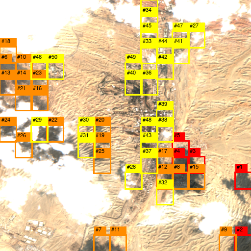
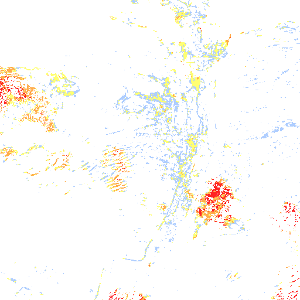
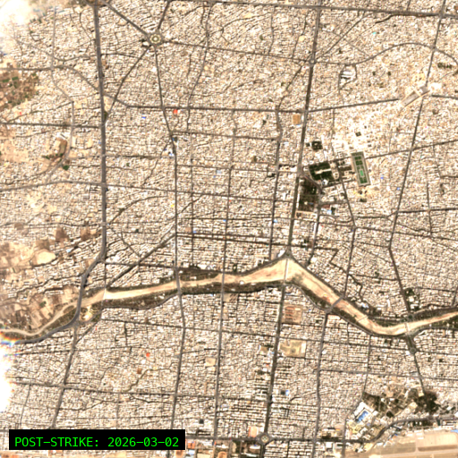

# 🛰️ Iran Damage Assessment Platform

**Real-time satellite intelligence and damage assessment platform for monitoring strategic infrastructure using multi-source satellite imagery and OSINT analysis.**

[](https://apimap-production.up.railway.app)
[](https://python.org)
[](https://reactjs.org)
[](https://docker.com)

---

## 📸 Screenshots

### Change Detection Analysis

*Automated damage detection with annotated satellite imagery showing before/after comparison*

### Thermal Heatmap

*Heat signature analysis for identifying active strike zones and damage patterns*

### Strike Assessment

*Post-strike satellite capture with ML-powered damage vectorization*

---

## ✨ Features

### 🗺️ Interactive Map Interface
- **Real-time satellite imagery** at 10m resolution (Sentinel-2 L2A)
- **574+ strategic targets** pre-loaded with coordinates
- Interactive click-to-analyze functionality
- Multi-layer visualization (optical, SAR, thermal)

### 📡 Multi-Source Satellite Data
| Source | Resolution | Type | Status |
|--------|------------|------|--------|
| Sentinel-2 L2A | 10m | Optical | ✅ Free |
| Sentinel-1 SAR | 10m | Radar | ✅ Free |
| PlanetScope | 3m | Optical | 🔑 API Key |
| Copernicus CDSE | 10m | Multi | 🔑 API Key |

### 🔍 ML-Powered Change Detection
- **Pixel difference analysis** with adaptive thresholding
- **NDVI vegetation change** detection
- **SAR log-ratio** analysis for all-weather monitoring
- **Blob vectorization** for damage polygon extraction
- Automatic cloud masking and filtering

### 📰 OSINT Intelligence Engine
- Real-time **GDELT news aggregation**
- Social media monitoring (Twitter, Reddit, RSS)
- Automated target discovery from news
- Correlation engine linking news to satellite imagery

### 📊 Output Formats
- Annotated satellite imagery (PNG)
- Change detection overlays
- Heatmap visualizations
- GeoJSON damage polygons
- Timelapse GIF animations

---

## 🚀 Quick Start

### Docker Deployment (Recommended)

```bash
# Clone the repository
git clone https://github.com/samo1279/iran-damage-assessment.git
cd iran-damage-assessment

# Build and run with Docker
docker build -t iran-damage-assessment .
docker run -d -p 8000:8000 --name iran-app iran-damage-assessment

# Access at http://localhost:8000
```

### Local Development

```bash
# Backend
cd sentinel_timelapse
python -m venv .venv
source .venv/bin/activate
pip install -r requirements.txt
python app.py

# Frontend (separate terminal)
cd frontend
npm install
npm run dev
```

---

## 🏗️ Architecture

```
┌─────────────────────────────────────────────────────────────┐
│                    React Frontend (Vite)                     │
│  ┌─────────┐  ┌─────────┐  ┌─────────┐  ┌─────────────────┐ │
│  │ MapView │  │ Targets │  │ Strikes │  │ OSINT News Panel│ │
│  └────┬────┘  └────┬────┘  └────┬────┘  └────────┬────────┘ │
└───────┼────────────┼────────────┼────────────────┼──────────┘
        │            │            │                │
        ▼            ▼            ▼                ▼
┌─────────────────────────────────────────────────────────────┐
│                  Flask REST API (Gunicorn)                   │
│  ┌──────────────┐  ┌──────────────┐  ┌──────────────────┐   │
│  │ /api/targets │  │ /api/analyze │  │ /api/osint       │   │
│  └──────┬───────┘  └──────┬───────┘  └────────┬─────────┘   │
└─────────┼─────────────────┼───────────────────┼─────────────┘
          │                 │                   │
          ▼                 ▼                   ▼
┌─────────────────┐ ┌───────────────┐ ┌─────────────────────┐
│  SQLite DB      │ │ STAC Clients  │ │  GDELT/RSS Feeds    │
│  (574 targets)  │ │ (Element84)   │ │  (News Intelligence)│
└─────────────────┘ └───────────────┘ └─────────────────────┘
```

---

## 🔧 Configuration

### Environment Variables

```bash
# Optional - Enhanced satellite sources
PL_API_KEY=your_planet_api_key          # PlanetScope 3m imagery
CDSE_CLIENT_ID=your_copernicus_id       # Copernicus Data Space

# Server configuration
PORT=8000                                # Server port
FLASK_ENV=production                     # Environment mode
```

### Docker Optimization (High-Throughput)

```bash
docker run -d \
  --name iran-app \
  --network host \
  --memory=4g \
  --memory-swap=4g \
  --ulimit nofile=65536:65536 \
  --mount type=tmpfs,destination=/tmp,tmpfs-size=512M \
  iran-damage-assessment
```

---

## 📡 API Endpoints

| Endpoint | Method | Description |
|----------|--------|-------------|
| `/api/targets` | GET | List all strategic targets |
| `/api/targets/<id>` | GET | Get target details |
| `/api/analyze/<id>` | POST | Run change detection |
| `/api/osint` | GET | Get latest OSINT intelligence |
| `/api/timelapse/<id>` | GET | Generate timelapse GIF |
| `/api/stream` | GET | SSE real-time updates |

---

## 🛡️ Data Sources

### Free (No API Key Required)
- **Sentinel-2 L2A**: 10m optical imagery via Element84 STAC
- **Sentinel-1 SAR**: 10m radar imagery (all-weather)
- **GDELT**: Global news intelligence feed
- **217 strategic targets**: Pre-loaded coordinate database

### Premium (API Key Required)
- **PlanetScope**: 3m daily imagery
- **Copernicus CDSE**: Enhanced European data

---

## 📦 Tech Stack

- **Backend**: Python 3.11, Flask, Gunicorn
- **Frontend**: React 18, TypeScript, Vite, TailwindCSS
- **Mapping**: Leaflet, React-Leaflet
- **Satellite**: Rasterio, GDAL, STAC-client
- **ML/CV**: NumPy, scikit-image, OpenCV
- **Database**: SQLite
- **Deployment**: Docker, Railway, Nginx

---

## 🌐 Deployment

### Railway (Cloud)
```bash
railway login
railway link
railway up
```

### Self-Hosted (VPS)
```bash
scp -r . user@server:/app
ssh user@server
cd /app && docker compose up -d
```

---

## 📄 License

MIT License - See [LICENSE](LICENSE) for details.

---

## 🙏 Credits

- Satellite data: [Copernicus Programme](https://www.copernicus.eu/)
- STAC API: [Element84](https://element84.com/)
- News data: [GDELT Project](https://www.gdeltproject.org/)

---

**Built with ❤️ for open-source intelligence**
