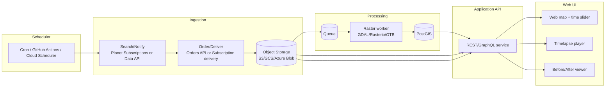

# Building an Automated 3‑Meter Satellite Change‑Detection App for Tehran and Isfahan

## Executive summary

A practical way to build an application that automatically **collects, archives, analyzes, and visualizes ~3 m imagery** for two city AOIs (Tehran and Isfahan) is to use **PlanetScope** as the primary commercial source (near‑daily 3 m products) and treat higher‑resolution systems (e.g., ~50 cm) as optional “zoom‑in” tiers. PlanetScope is commonly described as near‑daily/global coverage at 3 m (often resampled), and Sentinel Hub explicitly supports PlanetScope at 3 m with a 1‑day revisit claim in its dataset documentation. citeturn2view3turn8view0turn0search2

The most robust automation pattern is:

- **Ingestion:** subscription‑style delivery to your cloud bucket (preferred) or a scheduled search→order/download cycle. Planet’s Subscriptions API is positioned as the recommended continuous delivery method; it supports cloud delivery and can be configured around AOI and filters that mirror catalog searches. citeturn16search2turn4view2turn16search5  
- **Cloud masking:** per‑pixel usability with Planet’s **UDM2/UDM2.1** masks (clear/cloud/haze/shadow/snow classes) rather than relying purely on scene‑level “cloud percent”. citeturn2view2turn1search2turn1search9  
- **Change detection:** start with deterministic methods (radiometric normalization + pixel differencing + NDVI/NBR‑style indices where bands exist), then optionally add ML (U‑Net / Siamese change networks) for better object‑level outputs and confidence scoring. citeturn11search2turn11search0turn11search1turn11search3  
- **Visualization:** store events in PostGIS and serve time‑enabled overlays (vector tiles + before/after previews + timelapse). PostGIS provides first‑class vector tile functions (ST_AsMVT / ST_AsMVTGeom) and area computations on geography in meters. citeturn12search4turn12search0turn12search1  

One operational constraint: the Sentinel Hub EO Browser web app at apps.sentinel-hub.com displays a deprecation notice for March 20, 2026, indicating a platform transition—so treat browser‑based workflows as temporary and put automation behind APIs. citeturn10search0turn10search4

## Data sources and access models

### What “~3 m” typically means in practice

For PlanetScope “ortho” products, Planet’s product specification states an **orthorectified pixel size of 3.0 m** (with an average ground sample distance around 3.7 m at reference altitude) and describes the product as cartographically projected and intended for analytic use. citeturn8view0  
Sentinel Hub’s PlanetScope dataset page similarly describes PlanetScope as resampled to **3 m**, with “almost daily coverage worldwide” and a **1‑day revisit time**. citeturn2view3

### Primary provider: Planet delivery paths

**Direct Planet APIs (fastest for a custom app):**
- **Data API (search):** supports Quick Search and Saved Search; Quick Search can sort by acquired/published time and is recommended for ad‑hoc searches. citeturn2view1turn2view1  
- **Orders API (delivery/order by item IDs):** designed for ordering items by catalog IDs; can deliver to external cloud storage; optimized for ≤500 items per order and recommends Subscriptions for continuous/high‑volume delivery. citeturn14view0turn7search1  
- **Subscriptions API (continuous feed):** positioned as Planet’s recommended continuous cloud delivery; supports delivery blocks and hosting blocks for cloud destinations (including Amazon S3). citeturn16search2turn4view2turn16search5  
- **Cloud/usability masks:** Planet UDM2/UDM2.1 is a multiband GeoTIFF that classifies pixels (clear, cloud, haze, cloud shadow, snow), enabling pixel‑level filtering. citeturn2view2turn1search2turn1search9  

**Through Sentinel Hub (useful if you already rely on Sentinel Hub Process/OGC tooling):**
- Sentinel Hub supports PlanetScope purchasing/ordering and delivers ordered data into a BYOC collection (then you access via Process/OGC). It also documents minimum order/subscription constraints (e.g., minimum billed area) and order size limits. citeturn2view3turn0search6  
- Sentinel Hub notes commercial data access is not free due to licensing constraints. citeturn3search17turn0search33  

### Optional higher‑detail tiers for “zoom‑in”

If your app eventually needs to show finer change signatures than 3 m supports, add a secondary tier rather than forcing everything onto the 3 m pipeline:

- SkySat: Planet describes SkySat as sampled at **50 cm per pixel** when orthorectified and notes potential revisit up to **10× daily** (tasking/geometry dependent). citeturn3search1turn3search0  
- WorldView (via Sentinel Hub commercial workflows): Sentinel Hub documents supported resolutions (e.g., ~0.5 m pan / ~2 m multispectral) and describes ordering via a partner channel. citeturn4view3turn3search10  
- Airbus: Pléiades Neo is marketed at **30 cm** and “intra‑day revisit”. citeturn5search2  
- BlackSky: Gen‑3 marketing emphasizes hourly revisit and “very high‑resolution imagery,” with public investor material mentioning a trajectory toward ~35 cm class resolution. citeturn5search3turn5search7  

### Provider comparison table

| Provider / channel | Typical resolution relevant to this app | Revisit (as marketed/documented) | Latency cues (public) | Cost model (typical) | API / automation access |
|---|---:|---|---|---|---|
| PlanetScope (Planet) | ~3 m (ortho pixel size 3 m) | near‑daily / 1 day | publishing lifecycle includes preview/standard/finalized, with finalized ~12–24h after standard | subscription or per‑order; quota/model varies by plan | Data API + Orders API + Subscriptions API |
| PlanetScope via Sentinel Hub | 3 m (resampled) | 1 day (dataset doc) | depends on delivery/ingestion | purchase/plan + delivery to BYOC | TPDI/order/subscription → BYOC → Process/OGC |
| Airbus SPOT/Pléiades/Neo | ~1.5 m / 0.5 m / 0.3 m | daily to intra‑day (product dependent) | “archive & tasking” ordering; service-dependent | pay‑per‑order | OneAtlas APIs / ordering portals |
| BlackSky | sub‑meter to VHR class (product dependent) | “hourly revisit” positioning | marketed as rapid delivery | subscription/tasking dependent | platform APIs / marketplaces (e.g., UP42) |
| SkyWatch marketplace | depends on provider | depends on provider | depends on provider | pay‑as‑you‑use; published “starting at” prices/km² | marketplace ordering + delivery |
| UP42 marketplace | depends on provider | depends on provider | depends on provider | credits + minimum charges for catalog/tasking | catalog/tasking ordering APIs |

Sources for the key comparative claims above include Planet’s PlanetScope product spec and publishing lifecycle (pixel size and lifecycle timing), Sentinel Hub’s PlanetScope dataset documentation, Airbus ordering and Pléiades Neo pages, BlackSky Gen‑3 materials, and SkyWatch/UP42 marketplace docs. citeturn8view0turn9view0turn2view3turn5search2turn5search3turn5search12turn5search5

**Link pack (primary docs)**  
```text
Planet Data API (quick search + items/assets):
  https://docs.planet.com/develop/apis/data/item-search/
  https://docs.planet.com/develop/apis/data/items/

Planet Orders API / Subscriptions API:
  https://docs.planet.com/develop/apis/orders/
  https://docs.planet.com/develop/apis/subscriptions/
  https://docs.planet.com/develop/rate-limiting/

Planet UDM2:
  https://docs.planet.com/data/imagery/udm/

Sentinel Hub PlanetScope + BYOC/TPDI:
  https://docs.sentinel-hub.com/api/latest/data/planet/planet-scope/
  https://docs.sentinel-hub.com/api/latest/api/data-import/
  https://docs.sentinel-hub.com/api/latest/api/byoc/

CDSE Sentinel Hub (OAuth, Catalog, Process, quotas):
  https://documentation.dataspace.copernicus.eu/APIs/SentinelHub/Overview/Authentication.html
  https://documentation.dataspace.copernicus.eu/APIs/SentinelHub/Catalog.html
  https://documentation.dataspace.copernicus.eu/APIs/SentinelHub/Evalscript.html
  https://documentation.dataspace.copernicus.eu/APIs/SentinelHub/Overview/RateLimiting.html
  https://documentation.dataspace.copernicus.eu/Quotas.html

Remote sensing indices basics:
  https://www.usgs.gov/landsat-missions/landsat-normalized-difference-vegetation-index
  https://www.usgs.gov/landsat-missions/landsat-normalized-burn-ratio
```

## System architecture

A minimal, production‑oriented architecture separates “delivery/ingestion,” “heavy raster processing,” and “web serving” so you can scale each independently.



Why these components:
- Planet’s Subscriptions API supports continuous delivery and is designed for “continuous data feed over areas of interest.” citeturn16search2  
- Planet’s Orders API supports delivering imagery to external cloud storage and documents endpoint rate limits and order size constraints. citeturn14view0turn7search1  
- PostGIS can generate vector tiles directly (ST_AsMVT) and can compute areas on geography in square meters—both helpful for map overlays and metrics. citeturn12search4turn12search1  
- OTB is an open‑source remote sensing toolkit capable of large‑scale processing (including ortho/pansharpen/classification), complementing GDAL/Rasterio. citeturn15search0  

## AOIs for Tehran and Isfahan

### City‑center AOIs (~5 km × 5 km)

Use CRS84 (lon,lat). These AOIs are intentionally small to reduce cost and processing time. A 5×5 km AOI is ~25 km², which is also a useful mental model when evaluating per‑km² pricing/minimum order areas. citeturn5search16turn5search12

**CRS84 BBOX (paste‑ready)**  
```json
{
  "tehran_bbox_crs84": [51.362049329675, 35.666442220625, 51.417350670325, 35.711357779375],
  "isfahan_bbox_crs84": [51.643602920397, 32.642822220625, 51.696957079603, 32.687737779375]
}
```

**GeoJSON FeatureCollection (paste‑ready)**  
```json
{
  "type": "FeatureCollection",
  "features": [
    {
      "type": "Feature",
      "properties": { "name": "tehran_5km_box" },
      "geometry": {
        "type": "Polygon",
        "coordinates": [[
          [51.362049329675, 35.666442220625],
          [51.417350670325, 35.666442220625],
          [51.417350670325, 35.711357779375],
          [51.362049329675, 35.711357779375],
          [51.362049329675, 35.666442220625]
        ]]
      }
    },
    {
      "type": "Feature",
      "properties": { "name": "isfahan_5km_box" },
      "geometry": {
        "type": "Polygon",
        "coordinates": [[
          [51.643602920397, 32.642822220625],
          [51.696957079603, 32.642822220625],
          [51.696957079603, 32.687737779375],
          [51.643602920397, 32.687737779375],
          [51.643602920397, 32.642822220625]
        ]]
      }
    }
  ]
}
```

### Buffering guidance

Keep two AOIs per city in your system:
- **Processing AOI (expanded):** add a buffer (e.g., +500 m to +2 km) to reduce edge effects and make co‑registration more reliable.
- **Reporting AOI (exact):** the strict 5×5 km box you show to users and use for stats.

This reduces false positives caused by changed pixels near the boundaries when scenes are clipped/resampled. (The need for careful resampling/alignment is a known raster processing issue; GDAL’s warp docs describe resampling behavior and why grid differences matter.) citeturn12search3  

## Ingestion pipeline with paste‑ready API calls

### Recommended automation strategy

**Best reliability:** Planet Subscriptions API → deliver to your bucket → process immediately on arrival. Planet explicitly positions Subscriptions as the recommended approach for continuous delivery. citeturn16search2turn4view2

**Fallback (simple, controllable):** run every 6 hours:
1) Data API Quick Search: find PSScene items in `now-24h … now` intersecting AOI, filter by cloud percent, sort by published/acquired time. citeturn2view1turn4view1  
2) For the “best” candidate(s), either:
   - Data API assets: activate + download, or
   - Orders API: clip + deliver to your bucket (preferred over many single-asset downloads). citeturn4view0turn14view0  
3) Store raw imagery + UDM2 alongside metadata (timestamp, cloud stats, publishing stage). UDM2 exists for PlanetScope globally since ~2018 and classifies pixels into usability classes. citeturn2view2turn1search2  

### Planet Data API: quick search (cURL)

Planet’s docs show Quick Search at `https://api.planet.com/data/v1/quick-search` and support sorting by acquired/published times; Planet Support also provides a canonical JSON format example with GeometryFilter, DateRangeFilter, and cloud_percent RangeFilter. citeturn2view1turn4view1

```bash
# Credentials
export PL_API_KEY="YOUR_PLANET_API_KEY"

# Time window (examples; generate dynamically in code)
FROM="2026-03-04T00:00:00Z"
TO="2026-03-05T00:00:00Z"

# AOI geometry (example: Tehran bbox polygon)
cat > tehran_aoi.json <<'JSON'
{
  "type": "Polygon",
  "coordinates": [[
    [51.362049329675, 35.666442220625],
    [51.417350670325, 35.666442220625],
    [51.417350670325, 35.711357779375],
    [51.362049329675, 35.711357779375],
    [51.362049329675, 35.666442220625]
  ]]
}
JSON

# Quick Search: intersect AOI, date range, and coarse cloud percent filter
curl -s -X POST "https://api.planet.com/data/v1/quick-search?_sort=published%20desc&_page_size=50" \
  -u "${PL_API_KEY}:" \
  -H "Content-Type: application/json" \
  -d @- <<EOF | python3 -m json.tool
{
  "item_types": ["PSScene"],
  "filter": {
    "type": "AndFilter",
    "config": [
      { "type": "GeometryFilter", "field_name": "geometry", "config": $(cat tehran_aoi.json) },
      { "type": "DateRangeFilter", "field_name": "acquired", "config": { "gte": "$FROM", "lte": "$TO" } },
      { "type": "RangeFilter", "field_name": "cloud_percent", "config": { "gte": 0, "lte": 40 } }
    ]
  }
}
EOF
```

### Planet Data API: select best scene by AOI‑specific clear coverage

Planet’s Items/Assets docs describe an endpoint that recomputes clear coverage over a **user‑provided AOI** (not just whole scene), which is ideal for small AOIs like city centers. citeturn4view0

```bash
ITEM_ID="YOUR_ITEM_ID_FROM_SEARCH"

curl -s -X POST \
  "https://api.planet.com/data/v1/item-types/PSScene/items/${ITEM_ID}/coverage" \
  -u "${PL_API_KEY}:" \
  -H "Content-Type: application/json" \
  -d @- <<EOF | python3 -m json.tool
{ "geometry": $(cat tehran_aoi.json) }
EOF
```

### Planet Data API: list assets → activate → download

Planet’s Items/Assets docs provide the “list assets” endpoint and explain activation (“takes several minutes”), polling for state=active, and that downloading consumes quota. citeturn4view0turn7search2

```bash
# List assets
curl -s \
  "https://api.planet.com/data/v1/item-types/PSScene/items/${ITEM_ID}/assets" \
  -u "${PL_API_KEY}:" | python3 -m json.tool

# Activation:
# 1) Find the desired asset's _links.activate URL in the response.
# 2) POST to that activate URL.
# 3) Poll the assets endpoint until status becomes "active".
# 4) Download from the asset's "location" URL when active.
```

### Planet Subscriptions API: continuous delivery to a cloud destination

Planet describes Subscriptions as continuous delivery, with a `source` block that mirrors Data API filters and a `delivery` mechanism to cloud storage/destinations. citeturn16search2turn4view2turn16search13

Below is a **template** (fields vary by your account’s configured destinations). Use it for both AOIs by swapping the geometry and naming.

```bash
export PL_API_KEY="YOUR_PLANET_API_KEY"

curl -s -X POST "https://api.planet.com/subscriptions/v1/subscriptions" \
  -H "Authorization: api-key ${PL_API_KEY}" \
  -H "Content-Type: application/json" \
  -d @- <<'EOF' | python3 -m json.tool
{
  "name": "ps_tehran_daily_delivery",
  "source": {
    "type": "catalog",
    "parameters": {
      "item_types": ["PSScene"],
      "asset_types": ["ortho_analytic_4b_sr", "udm2"],
      "geometry": {
        "type": "Polygon",
        "coordinates": [[[51.362049329675,35.666442220625],[51.417350670325,35.666442220625],[51.417350670325,35.711357779375],[51.362049329675,35.711357779375],[51.362049329675,35.666442220625]]]
      },
      "start_time": "2026-03-01T00:00:00Z",
      "filter": {
        "type": "AndFilter",
        "config": [
          { "type": "RangeFilter", "field_name": "cloud_percent", "config": { "gte": 0, "lte": 40 } }
        ]
      }
    }
  },
  "delivery": {
    "type": "destination",
    "parameters": {
      "ref": "pl:destinations/YOUR_DESTINATION_REF",
      "path_prefix": "planet/tehran/psscene"
    }
  }
}
EOF
```

### Rate limits, quotas, and error handling essentials

**Planet:**
- Planet documents API rate limiting and advises respecting `Retry-After` when present and using exponential backoff. citeturn7search5  
- Planet Support states default rate limits are “approximately 5 per second for each API” (plan‑dependent). citeturn7search9  
- Planet’s Orders docs list endpoint‑specific r/s limits and note order creation constraints. citeturn14view0  
- Planet documentation notes downloading assets consumes quota (often tracked by area). citeturn4view0turn7search10  

**CDSE / Sentinel Hub (if you use Catalog/Process for Sentinel‑2 or as a processing wrapper):**
- CDSE documents both request‑rate and processing‑unit limits and explains how you can hit 429 when either policy is exceeded. citeturn6search2turn6search12  
- OAuth tokens should be reused until expiry (CDSE describes OAuth2 token usage and lifecycle). citeturn0search7turn6search2  

## Preprocessing and cloud masking

### Cloud masking for 3 m PlanetScope (recommended)

Use **UDM2/UDM2.1** as your authoritative per‑pixel usability mask:
- Planet’s UDM docs describe semantic classes (clear, cloud, haze, cloud shadow, snow) as multiband GeoTIFF. citeturn2view2turn1search2  
- This is better than filtering only by `cloud_percent` at the scene level because small AOIs can be clear even when the overall scene is not, and vice versa. Planet’s AOI coverage endpoint exists specifically to address this mismatch. citeturn4view0  

### Orthorectification and georegistration expectations

Planet’s product spec states PlanetScope Ortho Scene products are orthorectified, map‑projected, and have an orthorectified pixel size of **3 m**; it also reports positional accuracy on the order of <10 m RMSE (90th percentile) for those products. citeturn8view0  
In practice, that means you should still implement **co‑registration** (sub‑pixel alignment) before change detection to reduce false change from small geolocation differences.

### Suggested preprocessing steps (per AOI, per new scene)

1) **Clip** to buffered AOI (processing AOI).  
2) **Apply UDM2 mask** (set cloudy/hazy/shadow pixels to nodata). citeturn2view2turn1search2  
3) **Radiometric normalization** (optional but helpful for timelapse stability): e.g., per‑band percentile stretch based on clear pixels.  
4) **Co‑register** to a reference image (previous best clear scene) using a feature‑based alignment method or a geospatial resampling alignment if you accept some residual.  
5) **Resample to a fixed grid** (e.g., EPSG:3857 tile grid for web mapping or UTM zone for analysis).

**GDAL alignment/resampling (example)**  
GDAL’s warp tool documents resampling behavior and is commonly used for reprojection/resampling. citeturn12search3turn12search7

```bash
# Example: reproject/resample to 3 m grid (choose your target CRS carefully)
# -tr 3 3 sets pixel size to 3 m in projected units
# -r bilinear is typical for reflectance; use near/average as needed
gdalwarp \
  -t_srs EPSG:3857 \
  -tr 3 3 \
  -r bilinear \
  -dstnodata 0 \
  input_planetscope.tif aligned_3m_3857.tif
```

**COG export for web‑friendly delivery**  
GDAL documents the Cloud Optimized GeoTIFF driver and options. citeturn12search23turn12search15

```bash
gdal_translate -of COG \
  -co COMPRESS=DEFLATE \
  -co BLOCKSIZE=512 \
  aligned_3m_3857.tif aligned_3m_3857.cog.tif
```

### Recommended libraries

- GDAL: core raster transformations and formats (open source; includes many utilities). citeturn12search15turn12search3  
- Rasterio: practical windowed IO and resampling in Python (important when scenes are larger than RAM). citeturn15search1turn15search5turn15search12  
- OTB: remote sensing processing at scale; includes ortho/pansharpen/classification pipelines. citeturn15search0  

## Change detection, analytics, and PostGIS storage

### Method selection guidance (what to implement first)

**Baseline (fast, robust, explainable):**
- **Pixel differencing** on normalized RGB or reflectance bands  
- **Index differencing** when bands support it:
  - NDVI difference for vegetation change (USGS defines NDVI = (NIR–Red)/(NIR+Red)). citeturn11search1  
  - NBR difference for burn/char/soil disturbance signals (USGS defines NBR = (NIR–SWIR)/(NIR+SWIR)). citeturn11search0  

Note: PlanetScope standard 4‑band products (RGB+NIR) support NDVI but not classic NBR unless you have SWIR (PlanetScope does not provide SWIR in PSScene). SkySat/other sensors may provide a panchromatic band and can support pansharpened visualization, but that’s a separate tier. citeturn8view0turn3search1  

**ML tier (higher cost, better object‑level semantics):**
- U‑Net is a well‑known architecture for dense segmentation and is commonly adapted for change maps. citeturn11search2turn11search6  
- Siamese change detection networks (including global‑aware Siamese designs) are widely published for remote sensing change detection. citeturn11search3turn11search11  

### Confidence scoring (simple but useful)

A practical confidence score per detected polygon can combine:
- % of pixels marked “clear” by UDM2 (higher = better) citeturn2view2  
- magnitude of change signal (e.g., |Δreflectance| or |ΔNDVI|) citeturn11search1  
- persistence (change observed in ≥2 consecutive acquisitions reduces one‑off noise)

### Example Python pseudocode (per AOI)

```python
def detect_change(aoi_id, before_img, after_img, udm_before, udm_after):
    clear_mask = udm_before.clear & udm_after.clear  # boolean
    before = normalize(before_img, mask=clear_mask)
    after  = normalize(after_img,  mask=clear_mask)

    diff = abs(after - before).mean(axis=0)  # per-pixel mean abs diff across bands
    change_pixels = diff > threshold_for_aoi(aoi_id)

    blobs = vectorize_connected_components(change_pixels)
    events = []
    for poly in blobs:
        area_m2 = compute_area(poly)
        if area_m2 < MIN_AREA_M2:
            continue
        conf = score_confidence(poly, diff, clear_mask)
        events.append({
            "aoi_id": aoi_id,
            "bbox": poly.bounds,
            "geom": poly,
            "area_m2": area_m2,
            "confidence": conf,
        })
    return events
```

### PostGIS schema (paste‑ready)

PostGIS documentation confirms geography area computations return square meters, and it provides intersection/clip functions useful for AOI queries. citeturn12search1turn12search2turn12search6

```sql
-- AOIs
CREATE TABLE aoi (
  aoi_id TEXT PRIMARY KEY,
  name TEXT NOT NULL,
  geom geometry(Polygon, 4326) NOT NULL
);

-- Ingested scenes (metadata)
CREATE TABLE scene (
  scene_id TEXT PRIMARY KEY,
  provider TEXT NOT NULL,                -- "planetscope"
  acquired_at TIMESTAMPTZ NOT NULL,
  published_at TIMESTAMPTZ,
  aoi_id TEXT NOT NULL REFERENCES aoi(aoi_id),
  cloud_percent REAL,
  publishing_stage TEXT,                 -- preview/standard/finalized
  image_cog_uri TEXT NOT NULL,
  udm_cog_uri TEXT NOT NULL
);

-- Detected change events (vectorized polygons)
CREATE TABLE change_event (
  event_id UUID PRIMARY KEY DEFAULT gen_random_uuid(),
  aoi_id TEXT NOT NULL REFERENCES aoi(aoi_id),
  before_scene_id TEXT NOT NULL REFERENCES scene(scene_id),
  after_scene_id  TEXT NOT NULL REFERENCES scene(scene_id),
  detected_at TIMESTAMPTZ NOT NULL DEFAULT now(),
  geom geometry(Polygon, 4326) NOT NULL,
  area_m2 DOUBLE PRECISION NOT NULL,
  confidence REAL NOT NULL,
  class_hint TEXT,                       -- optional: "construction", "vegetation-loss", etc.
  summary JSONB
);

CREATE INDEX change_event_geom_gix ON change_event USING GIST (geom);
CREATE INDEX scene_aoi_time_idx ON scene (aoi_id, acquired_at);
```

### PostGIS query examples

**Events inside AOI and time window** (AOI polygon intersection): citeturn12search6turn12search2

```sql
SELECT event_id, detected_at, confidence, area_m2
FROM change_event
WHERE aoi_id = 'tehran'
  AND detected_at >= now() - interval '7 days'
ORDER BY detected_at DESC;
```

**Compute event area in m²** (cast to geography): citeturn12search1

```sql
SELECT event_id,
       ST_Area(geom::geography) AS area_m2
FROM change_event
WHERE event_id = '00000000-0000-0000-0000-000000000000';
```

**Serve vector tiles** (ST_AsMVT + ST_AsMVTGeom): citeturn12search4turn12search0

```sql
-- Inputs: z/x/y tile indices
-- (You typically wrap this in an API endpoint)
WITH bounds AS (
  SELECT ST_TileEnvelope(:z, :x, :y) AS geom
),
mvtgeom AS (
  SELECT
    event_id,
    confidence,
    area_m2,
    ST_AsMVTGeom(
      ST_Transform(e.geom, 3857),
      b.geom
    ) AS geom
  FROM change_event e
  JOIN bounds b ON ST_Intersects(ST_Transform(e.geom, 3857), b.geom)
  WHERE e.aoi_id = :aoi_id
    AND e.detected_at >= now() - interval '24 hours'
)
SELECT ST_AsMVT(mvtgeom, 'changes', 4096, 'geom') FROM mvtgeom;
```

## Timelapse, visualization, operations, and governance

### Timelapse generation (repeatable and cheap)

Use a fixed rendering recipe so frames are visually consistent:
- reproject/align all frames to the same grid
- apply the same percentile stretch based on clear pixels (UDM2)
- render to PNG frames
- encode to MP4 with ffmpeg (ffmpeg docs include CLI usage and option ordering) citeturn15search3

```bash
# frames named frame_0001.png, frame_0002.png, ...
ffmpeg -framerate 2 -i frame_%04d.png -c:v libx264 -pix_fmt yuv420p timelapse.mp4
```

### Example API response JSON (paste‑ready)

This is what your backend can return to the frontend for a time‑slider map:

```json
{
  "aoi_id": "tehran",
  "window": { "from": "2026-03-04T00:00:00Z", "to": "2026-03-05T00:00:00Z" },
  "events": [
    {
      "event_id": "b6b2f6a2-0e44-4cf9-98d9-1e2a7d39d9e5",
      "detected_at": "2026-03-05T06:12:34Z",
      "bbox_crs84": [51.3901, 35.6892, 51.3920, 35.6906],
      "centroid_crs84": [51.3911, 35.6899],
      "area_m2": 12800.5,
      "confidence": 0.82,
      "preview": {
        "before_png": "s3://.../before.png",
        "after_png": "s3://.../after.png",
        "diff_png": "s3://.../diff.png"
      },
      "downloads": {
        "before_cog": "s3://.../before.cog.tif",
        "after_cog": "s3://.../after.cog.tif",
        "udm_before": "s3://.../udm_before.tif",
        "udm_after": "s3://.../udm_after.tif"
      }
    }
  ]
}
```

### Automation and ops checklist

**Scheduler:** run every 6 hours to catch newly published scenes; Planet supports sorting by published time, and PlanetScope has publishing stages with preview/standard/finalized timing behavior (finalized ~12–24h after standard). citeturn2view1turn9view0

**Storage lifecycle (rolling 24h):**
- simplest: delete any objects older than now‑24h during your scheduled job
- or use storage lifecycle policies (exact mechanics depend on your cloud vendor)

**Monitoring:**
- alert on missing deliveries (no new scenes for >N days can be normal due to clouds/acquisition gaps)
- alert on repeated 429/5xx from APIs

**Rate limiting & retries:**
- Planet: respect `Retry-After` and backoff guidance. citeturn7search5  
- CDSE/Sentinel Hub (if used): watch both request‑rate and processing‑unit policies for 429. citeturn6search2turn6search12  

### Cost drivers (ballpark logic, not a quote)

Practical cost levers are dominated by:
- **area** (km²) and minimum billed area constraints (marketplaces and some providers publish minimum AOIs and “starting at” per‑km² pricing) citeturn5search16turn5search12  
- **frequency** (daily vs on‑demand orders; subscriptions vs per‑scene) citeturn16search2turn14view0  
- **delivery method and processing tools** (orders that clip or process can cost more than raw asset downloads; Planet orders docs emphasize tools and delivery as part of the order contract) citeturn14view0  
- **quota** (Planet notes downloads consume quota; quota is commonly tracked by area) citeturn4view0turn7search10  

### Security and ethics

This kind of system is dual‑use. Build safeguards so it supports lawful, ethical monitoring (e.g., land‑use, disaster impact, environmental change) and does not become a tool for harm:
- comply with imagery licensing (Sentinel Hub highlights commercial imagery has licensing constraints and is not freely accessible) citeturn3search17turn0search33  
- avoid “real‑time targeting” capabilities (e.g., do not expose instant alerts for sensitive sites; enforce time delays; restrict access; audit logs)
- manage privacy risk (limit resolution tiers to the minimum needed for your legitimate use case; apply access controls)

Finally, note the platform transition: EO Browser shows a public deprecation notice (March 20, 2026), reinforcing the recommendation to base your application on APIs and your own infrastructure rather than relying on a browser UI. citeturn10search0turn10search10