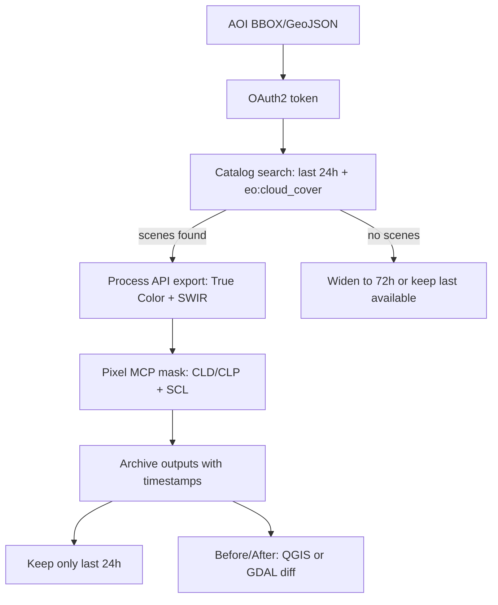

# Configuring Sentinel Hub to Auto‑Collect a Rolling 24‑Hour Archive for Tehran and Isfahan

## Executive summary

What you want is **not** something you can do purely inside the EO Browser UI as a “prompt” (EO Browser is an interactive viewer). To **automatically** collect and archive imagery on a rolling 24‑hour window, you need to use **Sentinel Hub APIs** (Catalog/STAC to find scenes → Process API to export GeoTIFF/PNG → your own scheduler + storage). citeturn9view1turn12view1

Two important constraints shape the whole design:

- **EO Browser is scheduled to be deprecated on March 20, 2026**, with workflows moving into Planet’s platform. So treat EO Browser steps as **short‑term/manual**, and build automation on APIs. citeturn0search0turn7view2  
- **Sentinel‑2 L2A (10 m)** is great for city-scale context (burn scars, large fires, damaged large facilities), but **cannot reliably show building‑level or “single impact point” damage**. (10 m means one pixel covers ~10×10 meters.) Your “strike impact point” goal generally requires **sub‑meter** commercial imagery; **3 m PlanetScope** can show larger changes, but not fine impact points. citeturn11view2turn4search0turn7view2

Below is a paste‑ready, end‑to‑end setup for:

- Sentinel‑2 L2A imagery via **Copernicus Data Space Ecosystem (CDSE) Sentinel Hub endpoints**  
- MCP‑style **cloud probability** masking using CLD/CLP + SCL  
- Optional **commercial 3 m PlanetScope** access paths when available to your account  

## AOIs for Tehran and Isfahan

City center coordinates (reference points) commonly cited for the city centers:

- Tehran: 35.6889, 51.3897 citeturn18search6  
- Isfahan: 32.66528, 51.67028 citeturn18search6  

The following AOIs are ~**5 km × 5 km** boxes around those centers in **CRS84** (lon,lat order). They are deliberately “small and precise” so exports remain fast and cheap in processing units.

### CRS84 BBOXes (paste‑ready)

```json
{
  "tehran_bbox_crs84": [51.362049329675, 35.666442220625, 51.417350670325, 35.711357779375],
  "isfahan_bbox_crs84": [51.643602920397, 32.642822220625, 51.696957079603, 32.687737779375]
}
```

### GeoJSON FeatureCollection (paste‑ready)

```json
{
  "type": "FeatureCollection",
  "features": [
    {
      "type": "Feature",
      "properties": { "name": "tehran_5km_box" },
      "geometry": {
        "type": "Polygon",
        "coordinates": [[
          [51.362049329675, 35.666442220625],
          [51.417350670325, 35.666442220625],
          [51.417350670325, 35.711357779375],
          [51.362049329675, 35.711357779375],
          [51.362049329675, 35.666442220625]
        ]]
      }
    },
    {
      "type": "Feature",
      "properties": { "name": "isfahan_5km_box" },
      "geometry": {
        "type": "Polygon",
        "coordinates": [[
          [51.643602920397, 32.642822220625],
          [51.696957079603, 32.642822220625],
          [51.696957079603, 32.687737779375],
          [51.643602920397, 32.687737779375],
          [51.643602920397, 32.642822220625]
        ]]
      }
    }
  ]
}
```

## MCP cloud probability filtering

### What “MCP” should mean in Sentinel Hub terms

Sentinel Hub exposes multiple cloud-related inputs for Sentinel‑2 L2A:

- **CLD**: Sen2Cor **cloud probability** (percent 0–100) at **20 m**. citeturn15search2turn0search11  
- **CLP**: s2cloudless **cloud probability** stored as 0–255 (divide by 255 → 0–1) at **160 m**; **CLM** is a 0/1 mask. citeturn0search7turn15search2  
- **SCL**: Sen2Cor **scene classification** (categorical) at **20 m** with codes like cloud shadow (3), cloud medium/high (8/9), cirrus (10). citeturn15search2turn11view2  

A robust “MCP cloud probability filter” therefore has two layers:

1) **Scene/tile prefilter** at search time: use `eo:cloud_cover` (Catalog) and/or `maxCloudCoverage` (Process). This is **metadata-based** and can miss local clouds in your AOI because cloud % is computed for a full tile/scene. citeturn9view1turn11view2turn3view0  
2) **Pixel-level masking** at render time: use CLD (or CLP) plus SCL to set alpha=0 for cloudy pixels. citeturn15search2turn0search7turn12view1  

### MCP thresholds: 20 / 40 / 60 tradeoff table

These thresholds apply to **CLD (%)** or **CLP probability** (after dividing by 255).

| MCP threshold | Kept pixels/images | Cloud leakage risk | Typical use |
|---|---|---|---|
| 20% | Lowest retention | Lowest leakage | “Only analyze very clear pixels” (more gaps/holes) |
| 40% | Balanced | Medium | Good starting point (often used as a default probability cutoff in practice) citeturn0search7 |
| 60% | Highest retention | Highest leakage | When you must avoid gaps and can tolerate thin clouds/haze |

Practical note: CLP is **160 m**, so it can under-mask small cloud edges over compact AOIs; CLD (20 m) + SCL (20 m) is usually the better “city AOI cloud mask” combination for Sentinel‑2 L2A. citeturn15search2turn0search7  

## Automation via CDSE endpoints

This section gives you paste‑ready API payloads and cURL. The flow is:

AOI → OAuth token → Catalog search (last 24h) → Process export (GeoTIFF) → save → repeat daily.

### Endpoints you will use (copy/paste)

```text
OAuth2 token endpoint:
  https://identity.dataspace.copernicus.eu/auth/realms/CDSE/protocol/openid-connect/token

Catalog (STAC) search endpoint:
  https://sh.dataspace.copernicus.eu/api/v1/catalog/1.0.0/search

Process API endpoint:
  https://sh.dataspace.copernicus.eu/api/v1/process
```

The token endpoint, reuse guidance, and “don’t request a token per call” are explicitly documented. citeturn14view0  
Catalog and Process endpoints and example request shapes are documented in the CDSE Sentinel Hub docs. citeturn8view0turn12view1  

### OAuth2 token (cURL) with reuse notes

**Do this once per run**, then reuse the token until it expires (tokens embed expiry in `exp`; token requests are rate limited). citeturn14view0turn1search2

```bash
export CDSE_CLIENT_ID="YOUR_CLIENT_ID"
export CDSE_CLIENT_SECRET="YOUR_CLIENT_SECRET"

ACCESS_TOKEN=$(curl -s \
  -X POST \
  -H "content-type: application/x-www-form-urlencoded" \
  -d "grant_type=client_credentials&client_id=${CDSE_CLIENT_ID}" \
  --data-urlencode "client_secret=${CDSE_CLIENT_SECRET}" \
  "https://identity.dataspace.copernicus.eu/auth/realms/CDSE/protocol/openid-connect/token" \
  | python3 -c "import sys, json; print(json.load(sys.stdin)['access_token'])")

echo "$ACCESS_TOKEN" | cut -c1-40; echo "..."
```

Token reuse guidance and the exact token endpoint are in the CDSE Authentication documentation. citeturn14view0  

### Catalog/STAC search (last 24 hours) with `eo:cloud_cover` prefilter

The Catalog endpoint supports simple POST search with `bbox`, `datetime`, `collections`, plus the Filter extension (CQL2) where `eo:cloud_cover` is a valid property for Sentinel‑2 L2A searches. citeturn9view1turn11view2turn8view0  

**Tehran search (example)**

```bash
FROM="2026-03-04T00:00:00Z"
TO="2026-03-05T00:00:00Z"

curl -s \
  -X POST "https://sh.dataspace.copernicus.eu/api/v1/catalog/1.0.0/search" \
  -H "Authorization: Bearer $ACCESS_TOKEN" \
  -H "Content-Type: application/json" \
  -d '{
    "bbox": [51.362049329675, 35.666442220625, 51.417350670325, 35.711357779375],
    "datetime": "'"$FROM"'/'"'"$TO"'"'",
    "collections": ["sentinel-2-l2a"],
    "limit": 20,
    "filter": "eo:cloud_cover <= 30",
    "filter-lang": "cql2-text"
  }' | python3 -m json.tool
```

**Isfahan search (example)**: replace bbox with Isfahan’s.

If you see **no results** in 24 hours, that’s normal: Sentinel‑2 revisit is not “daily per city” in a strict sense, and you may need to widen your search window to 72h or 7d and still run the pipeline daily. citeturn11view2turn9view1  

Operational caveat for today: CDSE reports an **ongoing STAC API availability issue** (March 5, 2026). If Catalog search fails, use the UI to find a recent sensing date and then call Process API directly. citeturn13search0  

### Process API export with pixel-level MCP masking

#### EvalScript: True Color RGBA with MCP mask (CLD + SCL)

This uses:
- SCL codes (3, 8, 9, 10) + CLD probability threshold  
- alpha=0 for masked pixels, alpha=1 for clear pixels

SCL/CLD definitions and value ranges are documented. citeturn15search2turn11view2  

```javascript
//VERSION=3
// Set MCP here: 20, 40, or 60 (percent)
var MCP = 40;

function setup() {
  return {
    input: ["B02", "B03", "B04", "SCL", "CLD", "dataMask"],
    output: { bands: 4 }
  };
}

function isCloud(sample) {
  // SCL: 3 cloud shadow, 8/9 cloud medium/high, 10 cirrus
  var sclCloud = [3, 8, 9, 10].includes(sample.SCL);
  var probCloud = sample.CLD > MCP; // CLD is percent 0..100
  return sclCloud || probCloud;
}

function evaluatePixel(sample) {
  if (sample.dataMask === 0) return [0, 0, 0, 0];

  if (isCloud(sample)) return [0, 0, 0, 0];

  // Brighten reflectance to a good viewing range
  return [2.5 * sample.B04, 2.5 * sample.B03, 2.5 * sample.B02, 1];
}
```

#### Process API request JSON: GeoTIFF export (Tehran)

Key points:
- `type` must be `sentinel-2-l2a`. citeturn11view2  
- `maxCloudCoverage` is **per tile estimate** and “might not be directly applicable” to the AOI. citeturn11view2  
- Use `mosaickingOrder: "mostRecent"` to bias toward the newest tile in the time range. citeturn11view2  

```bash
FROM="2026-03-04T00:00:00Z"
TO="2026-03-05T00:00:00Z"

cat > tehran_truecolor_request.json <<'JSON'
{
  "input": {
    "bounds": {
      "properties": { "crs": "http://www.opengis.net/def/crs/OGC/1.3/CRS84" },
      "bbox": [51.362049329675, 35.666442220625, 51.417350670325, 35.711357779375]
    },
    "data": [
      {
        "type": "sentinel-2-l2a",
        "dataFilter": {
          "timeRange": { "from": "__FROM__", "to": "__TO__" },
          "maxCloudCoverage": 70,
          "mosaickingOrder": "mostRecent"
        }
      }
    ]
  },
  "output": {
    "width": 512,
    "height": 512
  },
  "evalscript": "__EVALSCRIPT__"
}
JSON

# Replace placeholders safely:
python3 - <<'PY'
import json
from pathlib import Path

FROM = "2026-03-04T00:00:00Z"
TO   = "2026-03-05T00:00:00Z"

evalscript = Path("tehran_truecolor_evalscript.js").read_text()

req = json.loads(Path("tehran_truecolor_request.json").read_text())
req["input"]["data"][0]["dataFilter"]["timeRange"]["from"] = FROM
req["input"]["data"][0]["dataFilter"]["timeRange"]["to"] = TO
req["evalscript"] = evalscript

Path("tehran_truecolor_request.final.json").write_text(json.dumps(req))
print("Wrote tehran_truecolor_request.final.json")
PY

curl -s \
  -X POST "https://sh.dataspace.copernicus.eu/api/v1/process" \
  -H "Authorization: Bearer $ACCESS_TOKEN" \
  -H "Content-Type: application/json" \
  -H "Accept: image/tiff" \
  -d @tehran_truecolor_request.final.json \
  -o tehran_truecolor_last24h.tif
```

The Process API endpoint, request structure, and using `Accept: image/tiff` are shown in the official Process API examples. citeturn12view1turn12view0  

#### SWIR composite export (burn/scorch sensitivity)

A common SWIR‑forward composite for “burned / scorched / disturbed surfaces” uses B12/B11 with a visible band. CDSE documentation explicitly shows mixing SWIR bands 11 and 12 into a display script example. citeturn20view0  

Use this evalscript (also MCP‑masked):

```javascript
//VERSION=3
var MCP = 40;

function setup() {
  return {
    input: ["B04", "B11", "B12", "SCL", "CLD", "dataMask"],
    output: { bands: 4 }
  };
}

function isCloud(sample) {
  return (sample.CLD > MCP) || [3, 8, 9, 10].includes(sample.SCL);
}

function evaluatePixel(sample) {
  if (sample.dataMask === 0) return [0, 0, 0, 0];
  if (isCloud(sample)) return [0, 0, 0, 0];

  // SWIR2/SWIR1/Red
  return [2.5 * sample.B12, 2.5 * sample.B11, 2.5 * sample.B04, 1];
}
```

Band availability (including B11/B12) and CLD/SCL availability for Sentinel‑2 L2A are documented. citeturn0search11turn15search2  

### WMS/WCS usage with EVALSCRIPT and MAXCC

OGC services require a **configuration instance ID**. CDSE docs specify base URLs:

- WMS: `https://sh.dataspace.copernicus.eu/ogc/wms/<INSTANCE_ID>` citeturn16search2  
- WCS: `https://sh.dataspace.copernicus.eu/ogc/wcs/<INSTANCE_ID>` citeturn16search0  

Custom parameters include:
- `MAXCC` (cloud coverage %; product average, not viewport accurate) citeturn3view0  
- `EVALSCRIPT` (must be Base64‑encoded) or `EVALSCRIPTURL` citeturn3view0turn16search1  

**Example WMS GetMap (template)**

```text
https://sh.dataspace.copernicus.eu/ogc/wms/<INSTANCE_ID>?
SERVICE=WMS&REQUEST=GetMap&VERSION=1.3.0&
LAYERS=<LAYER_NAME>&
CRS=EPSG:4326&
BBOX=35.666442220625,51.362049329675,35.711357779375,51.417350670325&
WIDTH=512&HEIGHT=512&
FORMAT=image/png&
TIME=2026-03-04/2026-03-05&
MAXCC=30&
PRIORITY=mostRecent&
EVALSCRIPT=<BASE64_ENCODED_EVALSCRIPT>
```

**Example WCS GetCoverage (template)**

```text
https://sh.dataspace.copernicus.eu/ogc/wcs/<INSTANCE_ID>?
SERVICE=WCS&REQUEST=GetCoverage&VERSION=2.0.1&
COVERAGEID=<LAYER_NAME>&
SUBSET=Lat(35.666442220625,35.711357779375)&
SUBSET=Long(51.362049329675,51.417350670325)&
FORMAT=image/tiff&
TIME=2026-03-04/2026-03-05&
MAXCC=30&
EVALSCRIPT=<BASE64_ENCODED_EVALSCRIPT>
```

The base URLs and supported standard requests are in the official WMS/WCS docs. citeturn16search2turn16search0  

### BatchV2 daily archiving vs cron fallback

**BatchV2** is an asynchronous service that delivers results to your object storage, and the docs state it is **only available for Copernicus Service user accounts**. citeturn2view0  

If you *are* eligible, the BatchV2 examples show the payload structure (`processRequest` + tiling grid + S3 delivery) and the endpoint `https://sh.dataspace.copernicus.eu/api/v2/batch/process`. citeturn22view2turn22view0  

If you are **not** eligible (most users), do this instead:

- run a daily cron (or GitHub Action) that:
  1) calls Catalog search for `now-24h/now`  
  2) if any scenes are returned, call Process API export  
  3) write files into `archive/<city>/<timestamp>/...` and delete anything older than 24h  

### Rate limits, quotas, and practical “don’t get 429” rules

- CDSE imposes quotas per month and per minute, plus processing unit limits; these are documented under Quotas and Limitations. citeturn1search13turn1search2  
- Token requests are rate limited; CDSE explicitly says: **don’t fetch a token per request**—reuse until expiry. citeturn14view0  
- The UI and downloads can hit `429: Max session number 4 exceeded` if you attempt too many parallel downloads; limitation is discussed publicly in CDSE forum guidance. citeturn1search10turn1search6  

## EO Browser UI steps on apps.sentinel-hub.com

EO Browser is useful for fast inspection and manual exports, but it is not your automation engine. EO Browser’s own documentation highlights that you can pick criteria like cloud coverage/time range and download the current view as PNG/JPG/GeoTIFF. citeturn7view1turn7view2  

Also note: EO Browser documentation explicitly warns that cloud coverage conditions are applied at **full scene level** (large footprints), so you can still get local clouds. citeturn7view2  

### Exact click-path for Tehran / Isfahan (Sentinel‑2 L2A)

1) Open EO Browser (apps.sentinel-hub.com) and go to **Visualize**. citeturn7view2  
2) In **Dataset**, select **Sentinel‑2 L2A**. (This is the L2A atmospherically corrected product stream used throughout Sentinel Hub.) citeturn11view2turn7view2  
3) In the search bar, type:
   - `Tehran` and press Enter, then zoom until the AOI is within view, or  
   - `Isfahan` and press Enter.  
   (Copernicus Browser docs show the same basic workflow: zoom/search → visualize latest.) citeturn20view2  
4) Set the **Cloud coverage filter** (usually a slider/advanced option in the results/visualize workflow). EO Browser documentation describes selecting criteria including cloud coverage. citeturn7view0turn7view2  
5) Set your **time window**:
   - For “last 24 hours”, set date range to today and yesterday (if the UI uses a calendar range / timespan). EO Browser supports selecting dates via calendar/timespan. citeturn7view1turn7view2  
6) Choose visualization presets (left list):
   - **True color** (context)  
   - **False color (urban)** (built-up vs vegetation/soil contrast; good for changes in large surfaces)  
   - **SWIR** (useful for burn/scorch signatures and disturbed ground at city scale)  
   These presets exist in EO Browser’s approach, and Copernicus Browser docs also explain selecting prepared layers and creating custom composites/scripts. citeturn20view2turn7view2  
7) Export:
   - Use the **Download** tool to export:
     - quick **PNG/JPG**, or  
     - **GeoTIFF** for analysis in GIS.  
   EO Browser docs explicitly describe downloading in multiple formats including GeoTIFF. citeturn7view1turn7view2  

### Can you apply “MCP cloud probability” in the UI?

Not as a simple toggle. EO Browser “cloud coverage” is typically a **scene-level filter**, not pixel-level MCP. EO Browser docs explicitly note scene-level cloud filtering (large footprint). citeturn7view2  

To get MCP‑style pixel masking in a UI, you need to use a **custom script** (similar to the Process API evalscript you saw above). Copernicus Browser documentation shows using a pencil/editor flow to copy scripts to an editor and tweak them (band math, SWIR overlays, etc.). citeturn20view1turn20view0  

## Commercial 3–5 m imagery options within Sentinel Hub

If you truly need **higher spatial detail than 10 m**, Sentinel Hub documentation states that EO Browser can work with **commercial datasets** (PlanetScope 3 m; also sub‑meter options like SkySat/WorldView depending on licensing). citeturn7view2turn4search20  

### PlanetScope (3 m) through Sentinel Hub

Sentinel Hub’s PlanetScope documentation states:

- PlanetScope is **~3 m** and “almost daily” / 1‑day revisit in their summary of properties. citeturn4search0  
- Access requires purchasing/subscribing and using Planet ordering/subscription delivery into Sentinel Hub. citeturn4search0turn4search24  

A key operational advantage for your “rolling 24‑hour archive” goal: Sentinel Hub’s FAQ explains PlanetScope **subscriptions can cover future dates** and future products will be ingested automatically as soon as available (while the subscription is active). citeturn4search24  

### How commercial data integrates technically

Sentinel Hub documents that **Third Party Data Import (TPDI)** imports commercial data into **BYOC collections**, and then you access it through Process/OGC like any other collection. citeturn4search9turn22view2  

Also, Sentinel Hub’s FAQ explicitly lists supported commercial collections and notes they cannot provide free access due to licensing. citeturn4search10  

### Minimal “what to do” if you have PlanetScope access

1) Order/subscribe PlanetScope for each AOI (Tehran, Isfahan) with delivery to Sentinel Hub (preferred approach is via Planet subscription/order API with delivery). citeturn4search0turn4search24  
2) Once ingested, you get a BYOC `collectionId`. Access via Process API using `type: "byoc-<collectionId>"` (pattern shown in Sentinel Hub’s commercial import examples). citeturn4search7turn4search9  
3) Use the same MCP masking idea, but note: PlanetScope bands differ (typically 4‑band or 8‑band); follow PlanetScope examples to request true color at 3 m. citeturn4search3turn4search0  

## Before/after change detection after you’ve exported GeoTIFFs

This is the simplest reliable pattern for “did something change here?” once you have “before” and “after” GeoTIFFs.

### QGIS steps (align → subtract → visualize)

- **Align rasters** to same grid/CRS/resolution using QGIS “Align rasters.” citeturn17search2  
- Use **Raster Calculator** to compute differences; QGIS documents that Raster Calculator produces a new raster based on pixel-wise expressions. citeturn17search3  

### GDAL commands (scriptable)

**Pixel-wise difference** with `gdal_calc.py` (supports numpy arithmetic): citeturn17search0  

```bash
gdal_calc.py -A after.tif -B before.tif --calc="A-B" --outfile=diff.tif
```

**Convert GeoTIFF → COG** with GDAL’s built-in COG driver: citeturn19search0  

```bash
gdal_translate -of COG \
  -co COMPRESS=DEFLATE \
  -co BLOCKSIZE=512 \
  input.tif output_cog.tif
```

### Mermaid overview of the automation loop



If you want, paste your **current EO Browser share link** (the URL that includes `lat=...&lng=...`) and tell me which MCP threshold you prefer (20/40/60). I’ll return **two finalized JSON requests per AOI** (True Color + SWIR), already filled with your exact bbox/time window and ready for direct `curl` execution.