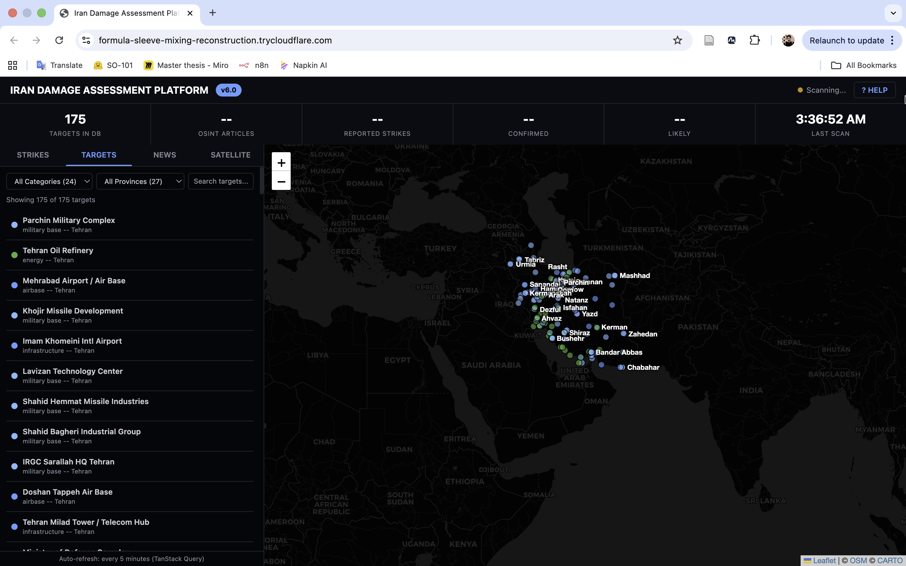
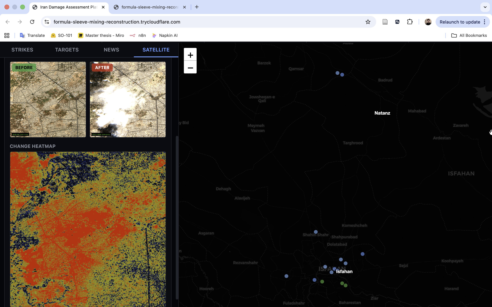
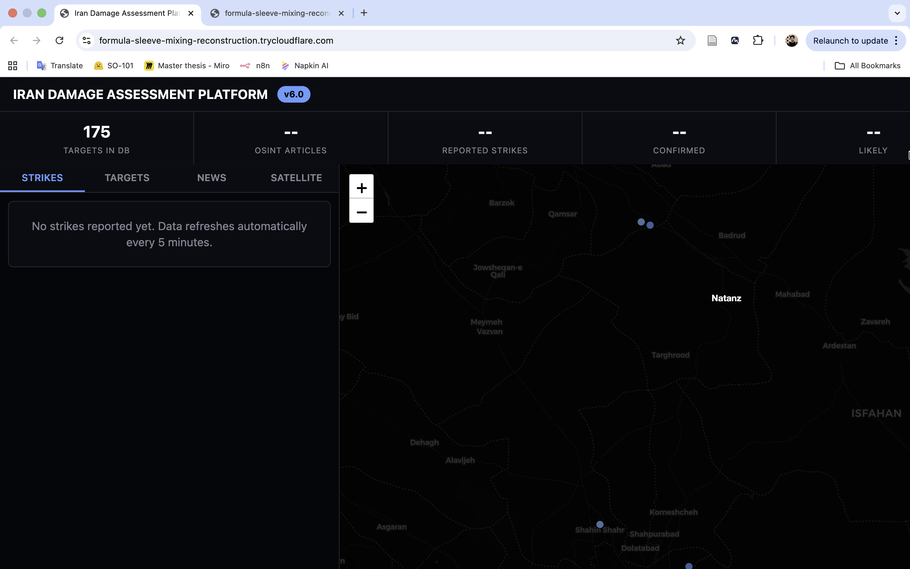
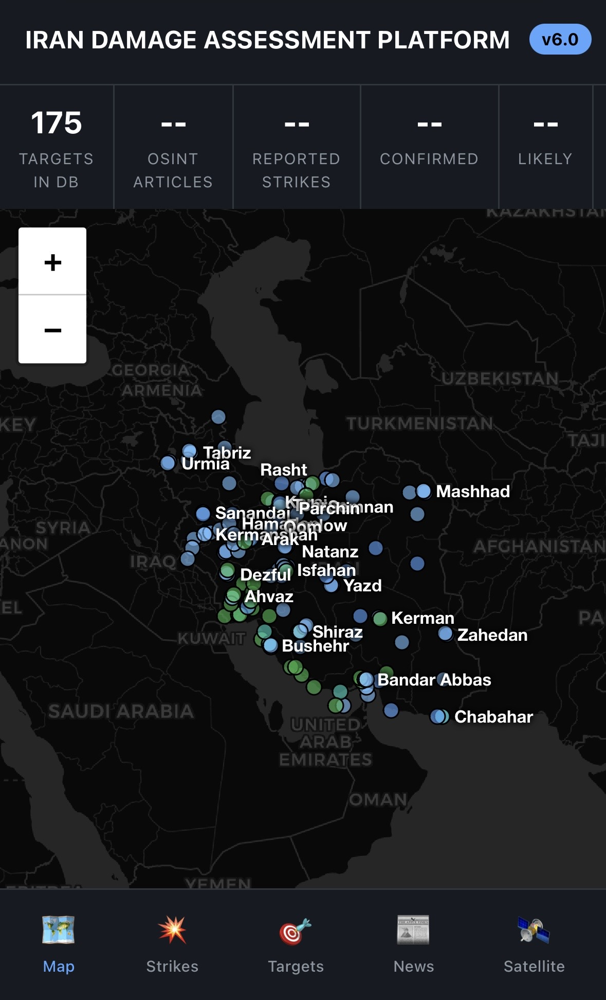

# 🛰️ Iran OSINT Damage Assessment Platform


Real-time satellite imagery analysis platform for monitoring structural changes and damage assessment in Iran using Sentinel-2 and Sentinel-1 SAR data.

---

## 🌐 Live Demo

### 👉 [Open Live App](https://formula-sleeve-mixing-reconstruction.trycloudflare.com)

> ⚠️ Note: Demo URL may change periodically. Check back here for the latest link.

---

## 📸 Screenshots

### Main Dashboard
<p align="center">
  
</p>

*Interactive map with 175+ strategic targets, real-time OSINT news feed, and satellite imagery controls*

### Satellite Comparison View
<p align="center">
  
</p>

*Before/After comparison with damage heatmap overlay*

### Strike Analysis Panel
<p align="center">
  
</p>

*Detected strike events with confidence scoring and satellite evidence*

### Mobile Responsive
<p align="center">
  
</p>

*Fully responsive design for field operations*

---

## ⚡ Key Features

### 🗺️ Interactive Map
- **175+ pre-loaded targets** - Military bases, nuclear facilities, air defense sites
- Real-time clustering and filtering by category
- Click any location to analyze satellite imagery

### 📡 Multi-Source Satellite Data
| Source | Type | Resolution | Access |
|--------|------|------------|--------|
| Sentinel-2 L2A | Optical | 10m | Free (ESA) |
| Sentinel-1 SAR | Radar | 10m | Free (ESA) |
| Planet Labs | Optical | 3m | API Key Required |
| CDSE | Optical | 10m | OAuth2 |

### 🔍 Damage Detection
- Pixel-difference change detection algorithm
- Heatmap visualization of structural changes
- Confidence scoring (0-100%)
- Cloud masking with SCL band

### 📰 OSINT News Integration
- GDELT API real-time news feed
- Automatic target correlation
- Conflict event monitoring

---

## 🚀 Quick Start

### Prerequisites
- Python 3.11+
- Node.js 20+
- Git

### Installation

```bash
# Clone the repository
git clone https://github.com/samo1279/iran-damage-assessment.git
cd iran-damage-assessment

# Install Python dependencies
pip install -r requirements.txt

# Build React frontend
cd frontend
npm install
npm run build
cd ..

# Run the app
python app.py
```

🌐 Open: **http://localhost:9000**

---

## 🔑 Environment Variables (Optional)

Copy `.env.example` to `.env`:

```bash
cp .env.example .env
```

Configure optional API keys:

```env
# Planet Labs - high-resolution imagery (3m)
PL_API_KEY=your_planet_api_key

# Copernicus Data Space - direct ESA access
CDSE_CLIENT_ID=your_client_id
CDSE_CLIENT_SECRET=your_client_secret
```

> 💡 The app works without these keys using free Element84 STAC API

---

## 📁 Project Structure

```
iran-damage-assessment/
├── app.py                 # Flask API server (17+ endpoints)
├── osint_engine.py        # 175+ targets + GDELT integration
├── change_detector.py     # Damage detection algorithms
├── multi_source.py        # Multi-satellite data fetching
├── planet_fetcher.py      # Planet Labs API
│
├── frontend/              # React 18 + TypeScript + Vite
│   ├── src/
│   │   ├── components/    # MapView, Panels, UI
│   │   ├── api/           # TanStack Query hooks
│   │   └── store/         # Zustand state management
│   └── dist/              # Production build
│
├── timelapse_output/      # Generated GIFs
├── requirements.txt       # Python dependencies
├── package.json           # Node dependencies
└── .env.example           # Environment template
```

---

## 🛠️ Tech Stack

### Backend
| Technology | Purpose |
|------------|---------|
| Flask | Web framework & API |
| Rasterio | GeoTIFF processing |
| OpenCV | Image analysis |
| NumPy | Array operations |
| Pillow | Image manipulation |

### Frontend
| Technology | Purpose |
|------------|---------|
| React 18 | UI framework |
| TypeScript | Type safety |
| Vite | Build tool |
| TanStack Query | Data fetching |
| Zustand | State management |
| Tailwind CSS | Styling |
| React-Leaflet | Interactive maps |
| Recharts | Data visualization |

### Data Sources
| API | Data |
|-----|------|
| Element84 STAC | Sentinel-2/1 catalog |
| Copernicus CDSE | ESA data access |
| GDELT | News & events |

---

## 📡 API Reference

| Endpoint | Method | Description |
|----------|--------|-------------|
| `/api/targets` | GET | Get all 175+ targets |
| `/api/strikes` | GET | Get detected strike events |
| `/api/news` | GET | Get GDELT news feed |
| `/api/stats` | GET | Dashboard statistics |
| `/api/generate-timelapse` | POST | Create before/after GIF |
| `/api/search-scenes` | POST | Search satellite imagery |
| `/api/data-availability` | POST | Check image availability |
| `/api/analyze-change` | POST | Run damage detection |

---

## 🚀 Deployment

### Deploy to Your Server

```bash
# On your Linux server
git clone https://github.com/samo1279/iran-damage-assessment.git
cd iran-damage-assessment

# Setup
python3 -m venv venv
source venv/bin/activate
pip install -r requirements.txt
cd frontend && npm install && npm run build && cd ..

# Run with Gunicorn
gunicorn app:app --bind 0.0.0.0:9000 --workers 4
```

### Using Cloudflare Tunnel (Hide IP)

```bash
cloudflared tunnel --url http://localhost:9000
```

---

## 🤝 Contributing

1. Fork the repository
2. Create feature branch (`git checkout -b feature/amazing`)
3. Commit changes (`git commit -m 'Add feature'`)
4. Push to branch (`git push origin feature/amazing`)
5. Open Pull Request

---

## 📜 License

MIT License - See [LICENSE](LICENSE) for details.

---

## 👤 Author

**samo1279** - [@samo1279](https://github.com/samo1279)

---

## ⭐ Star History

If this project helps you, please give it a ⭐!

---

## ⚠️ Disclaimer

This tool uses **publicly available** satellite data from ESA Copernicus program. All analysis is based on open-source intelligence (OSINT) methods. For research and educational purposes only.
